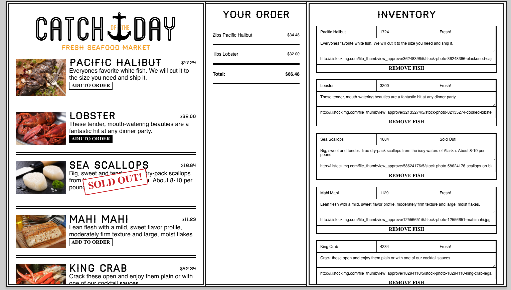

# Catch of the day

* How to run the application:

	- run 'npm install' in root directory
	- run 'npm start' to run the server

* Functionality:

	- Create, update, delete and order fish in this React application. Simple Firebase server.  

	